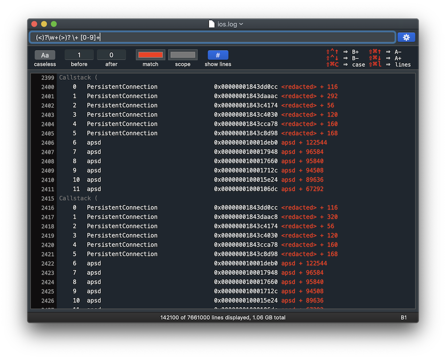

## Peculiar Log

**PeculiarLog** is a lightweight log filtering tool supporting regular expressions and instant (as-you-type) results.

It is designed to work with huge multi-gigabyte text files utilizing the power of **Intel Hyperscan** engine running on multiple CPU cores.



### Building

You can find most recent compiled version [here](https://github.com/alexhude/PeculiarLog/releases/latest/download/PeculiarLog.zip)

#### Prerequisites

Since **PeculiarLog** is based on Intel Hyperscan engine it is expecting headers to be available at `/usr/local/opt/hyperscan/include/hs` and **libhs.a** located at `/usr/local/lib`

Brew is the easiest way to install Hyperscan engine.

```
$ brew install hyperscan
```

#### Source

When everything is set, open Xcode project to build PeculiarLog from source. Minimum requirements - Xcode 9 and Swift 4.1.

#### AVX512 support

In order to make it even faster on host with **AVX512** instructions it is necessary to rebuild **HyperScan** with the following options.

```
$ mkdir build
$ cd build
$ cmake -DBUILD_AVX512=on -DCMAKE_BUILD_TYPE=Release -DBUILD_STATIC_AND_SHARED=on ../
$ make
```

Then link new `libhs.a` to the project or replace the one installed with Brew.

### Using

Just open app, drag log file to the icon and start typing regex in the field. Use setting panel or shortcuts to change scope, toggle caseless regex or line numbers.

#### Patterns

There are several limitation applied to the supported regex patterns by **Hyperscan**.

```
Hyperscan supports the pattern syntax used by the PCRE library (“libpcre”), 
described at <http://www.pcre.org/>. However, not all constructs available 
in libpcre are supported. The use of unsupported constructs will result in 
compilation errors.

The version of PCRE used to validate Hyperscan’s interpretation of this 
syntax is 8.41 or above.
```

#### Shortcuts

```
⇧ ⌃ ↑  - increase 'before' scope
⇧ ⌃ ↓  - decrease 'before' scope
⇧ ⌘ ↑  - decrease 'after' scope 
⇧ ⌘ ↓  - increase 'after' scope 
⇧ ⌘ c  - toggle caseless regex
⇧ ⌘ l  - toggle line numbers
```

There is also a hint on the right side of a settings panel.

### Demo


### Credits

Powered by [Hyperscan](https://www.hyperscan.io/)  
Icon is taken from [freeiconshop.com](https://freeiconshop.com/icon/filter-icon-flat/)
